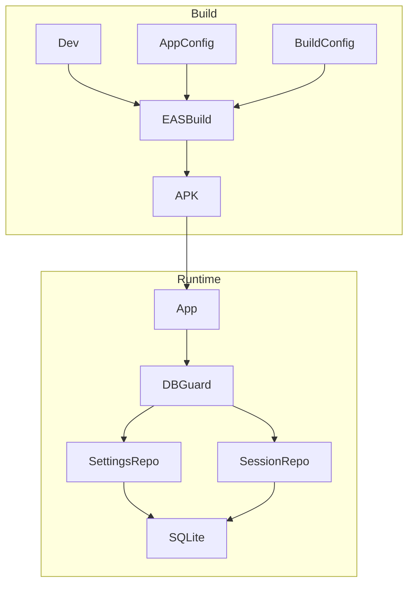
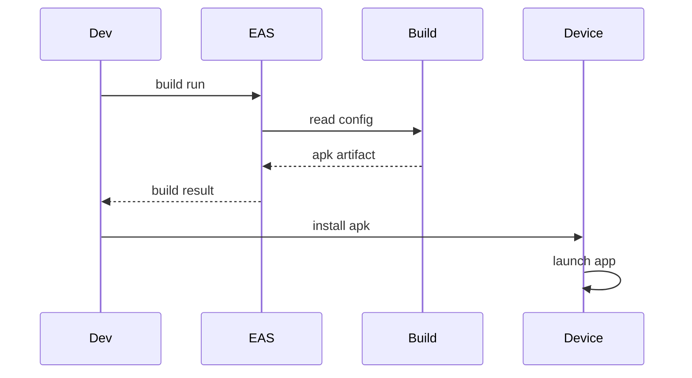
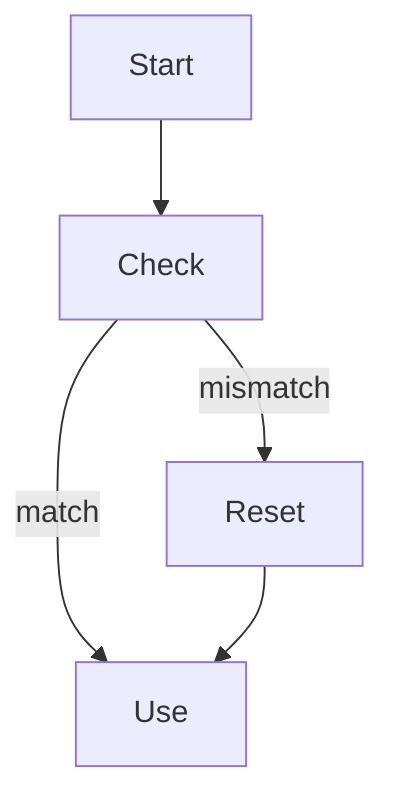
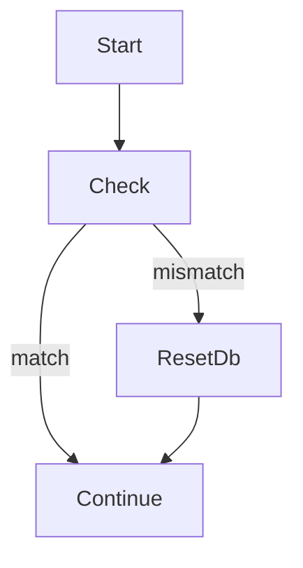

# デザインドキュメント

---
**Purpose**: Expo Go不要のスタンドアロンAPKを生成し、個人端末へ導入できる状態を整える。
**Approach**: EAS Buildのビルドプロファイルとアプリ設定を整理し、互換性のないDB変更は初期化で扱う。
---

## Overview
本機能は、Android端末向けにスタンドアロンAPKを生成し、Expo Goに依存せずインストール・起動できる状態を整える。ビルド設定は `eas.json` と `app.json` に集約し、個人配布に必要な手順をドキュメント化する。

また、更新頻度が高い運用を想定し、スキーマ互換性が破綻した場合はローカルDBを初期化して起動できるようにする。互換性判定には SQLite の `PRAGMA user_version` を用い、データ保持が必要な場合の本格マイグレーションは本スコープ外とする。

### Goals
- Expo Go不要のAPKを再現性高く生成できる
- 同一パッケージIDで上書き更新できる
- 互換性のないDB変更時に初期化して起動できる
- ビルド/インストール手順を明文化する

### Non-Goals
- Playストア公開やAABビルド対応
- アプリ内アップデート機能
- DBマイグレーションでのデータ保持
- 複数バリアントの同時インストール運用

## Requirements Traceability

| Requirement | Summary | Components | Interfaces | Flows |
|-------------|---------|------------|------------|-------|
| 1.1 | APKビルド生成 | BuildProfileConfig | BuildProfileConfig | BuildAndInstall |
| 1.2 | Expo Go不要で起動 | BuildProfileConfig, AppConfig | AppConfig | BuildAndInstall |
| 1.3 | 失敗ログ出力 | BuildProfileConfig, EASBuildService | BuildProfileConfig | BuildAndInstall |
| 2.1 | パッケージID定義 | AppConfig | AppConfig | - |
| 2.2 | 上書き更新 | AppConfig | AppConfig | - |
| 2.3 | 未設定通知 | AppConfig, BuildProfileConfig | AppConfig | - |
| 2.4 | 互換性なし時DB初期化 | DatabaseCompatibilityGuard, SettingsRepository, SessionRepository | DatabaseCompatibilityService | DbCompatibility |
| 3.1 | 前提条件記載 | Documentation | - | - |
| 3.2 | ビルド手順記載 | Documentation, BuildProfileConfig | - | - |
| 3.3 | インストール手順記載 | Documentation | - | - |
| 3.4 | 個人利用注意点 | Documentation | - | - |

## Architecture

### Existing Architecture Analysis
- Expo/React Nativeの管理ワークフローを採用し、設定は `app.json` に集約。
- ローカル永続化は `expo-sqlite` を利用し、設定/履歴をSQLiteで保持。
- `SqliteSessionRepository` には簡易的な再構築ロジックが存在し、`SqliteSettingsRepository` には互換性管理がない。

### Architecture Pattern & Boundary Map
**Architecture Integration**:
- Selected pattern: 設定駆動のビルド構成 + 起動時互換性ガード（user_version）追加
- Domain/feature boundaries: ビルド設定はインフラ領域、DB互換性はデータ層に限定
- Existing patterns preserved: MVVM + UseCase + Repository、Expo管理ワークフロー
- New components rationale: BuildProfileConfigでAPK生成を保証し、DatabaseCompatibilityGuardで非互換時の初期化を担保
- Steering compliance: 既存のリポジトリ分離とExpo構成を維持



## Technology Stack

| Layer | Choice / Version | Role in Feature | Notes |
|-------|------------------|-----------------|-------|
| Build / Infra | EAS CLI + EAS Build | APK生成と配布用ビルド | `eas.json` でプロファイル管理 | 
| Config | Expo app.json | パッケージID/アプリ識別 | `android.package` を設定 | 
| Data / Storage | expo-sqlite | ローカルDB互換性チェック | 互換性破綻時は初期化 | 
| Documentation | README | 手順/注意点の明文化 | 個人利用向けに限定 | 

## System Flows

### BuildAndInstall


### DbCompatibility


## Components and Interfaces

| Component | Domain/Layer | Intent | Req Coverage | Key Dependencies (P0/P1) | Contracts |
|-----------|--------------|--------|--------------|--------------------------|-----------|
| BuildProfileConfig | Build/Infra | APKビルド用のプロファイルを定義 | 1.1, 1.3, 3.2 | EASBuildService (P0) | State |
| AppConfig | Config | AndroidパッケージIDを定義 | 2.1, 2.2, 2.3 | ExpoConfig (P0) | State |
| DatabaseCompatibilityGuard | Data | 互換性破綻時にDBを初期化 | 2.4 | SqliteSettingsRepository (P0), SqliteSessionRepository (P0) | Service |
| Documentation | Docs | ビルド/導入手順の記載 | 3.1, 3.2, 3.3, 3.4 | README (P1) | State |

### Build / Infra

#### BuildProfileConfig

| Field | Detail |
|-------|--------|
| Intent | APK生成のためのビルドプロファイルを定義する |
| Requirements | 1.1, 1.3, 3.2 |

**Responsibilities & Constraints**
- APK生成に必要なビルドタイプを宣言する
- 個人配布向けのプロファイルを明示し、既存のproduction運用と衝突しない

**Dependencies**
- Inbound: 開発者操作 — ビルド実行 (P0)
- Outbound: EASBuildService — ビルド実行と成果物生成 (P0)
- External: EAS CLI — ビルド実行コマンド (P0)

**Contracts**: Service [ ] / API [ ] / Event [ ] / Batch [ ] / State [x]

##### State Management
- State model: `eas.json` の build profile
- Persistence & consistency: リポジトリ直下でバージョン管理
- Concurrency strategy: 変更は人手レビューで同期

**Implementation Notes**
- Integration: `eas.json` に `preview` などのプロファイルを追加し、`android.buildType` を `apk` とする
- Validation: プロファイル未設定時はビルドコマンドが失敗し、ログで検知できること
- Risks: EAS設定変更が既存ビルドに影響するため、プロファイル分離を徹底

### Config

#### AppConfig

| Field | Detail |
|-------|--------|
| Intent | AndroidのパッケージIDを固定し上書き更新を可能にする |
| Requirements | 2.1, 2.2, 2.3 |

**Responsibilities & Constraints**
- AndroidパッケージIDを明示し、ビルドの前提条件にする
- パッケージIDの変更は別アプリ扱いになるため、原則固定

**Dependencies**
- Inbound: 開発者操作 — アプリ識別子の設定 (P0)
- Outbound: ExpoConfig — AndroidパッケージIDの取り込み (P0)

**Contracts**: Service [ ] / API [ ] / Event [ ] / Batch [ ] / State [x]

##### State Management
- State model: `app.json` の `android.package`
- Persistence & consistency: リポジトリ直下でバージョン管理
- Concurrency strategy: 変更はレビューを必須とする

**Implementation Notes**
- Integration: `android.package` は逆DNS形式の固定値とする
- Validation: 未設定時はビルド時に検知されること
- Risks: パッケージID変更によるデータ消失

### Data

#### DatabaseCompatibilityGuard

| Field | Detail |
|-------|--------|
| Intent | DB互換性を検出し、非互換時に初期化して起動できるようにする |
| Requirements | 2.4 |

**Responsibilities & Constraints**
- 起動時にスキーマ互換性を判定する
- 非互換時はローカルDBを初期化し、空の状態で起動できるようにする
- Web/テストのメモリ実装では初期化を即時成功として扱う
- 互換性判定は `PRAGMA user_version` の値で行う
 - 期待バージョンはアプリ内の `dbSchemaVersion` 定数で管理する

**Dependencies**
- Inbound: App起動フロー — 初回ロード時の互換性チェック (P0)
- Outbound: SqliteSettingsRepository — 設定テーブル初期化 (P0)
- Outbound: SqliteSessionRepository — 履歴テーブル初期化 (P0)
- External: SQLite — スキーマ状態の保持 (P0)

**Contracts**: Service [x] / API [ ] / Event [ ] / Batch [ ] / State [ ]

##### Service Interface
```typescript
type CompatibilityAction = 'ok' | 'reset';

type CompatibilityResult = {
  action: CompatibilityAction;
  reason?: 'schema-mismatch' | 'unknown';
};

interface DatabaseCompatibilityService {
  ensureCompatible(input: { expectedVersion: number }): Promise<CompatibilityResult>;
}
```
- Preconditions:
  - expectedVersion は正の整数
- Postconditions:
  - action が `reset` の場合、次回起動時にDBが空状態で利用可能
- Invariants:
  - 非互換時は履歴/設定の整合性より起動可用性を優先する

**Implementation Notes**
- Integration: アプリ起動時の単一ブートストラップで `ensureCompatible` を実行し、その後に各Repositoryを生成する
- Validation: `PRAGMA user_version` を読み取り、`dbSchemaVersion` と一致しない場合は初期化する
- Risks: `dbSchemaVersion` の更新漏れで初期化が起きない/初期化により履歴が消えるため、レビューとドキュメントで明示する

## Data Models

### Domain Model
- SchemaVersion: SQLiteの `PRAGMA user_version` に保存されるスキーマ互換性バージョン
- dbSchemaVersion: アプリ内で保持する期待バージョン（スキーマ変更時にインクリメント）
- Invariant: expectedVersion と一致しない場合は初期化対象

### Logical Data Model
**Structure Definition**:
- `PRAGMA user_version` をスキーマ互換性のメタ情報として保持

**Consistency & Integrity**:
- 互換性判定は起動時の単一トランザクションで実施
 - `dbSchemaVersion` はアプリ起動時に読み込まれ、`PRAGMA user_version` と一致しない場合に初期化する

## Error Handling

### Error Strategy
- ビルド失敗はEAS CLIのログ出力により原因を特定する
- DB初期化失敗時は空のデータ状態で起動し、再試行の余地を残す

### Error Categories and Responses
- **User Errors**: パッケージID未設定 → ビルド失敗ログで通知
- **System Errors**: EASビルド失敗 → ログ確認を促す
- **Business Logic Errors**: DB互換性不一致 → 初期化で継続

### Monitoring
- ビルドログを記録し、必要に応じて保存する

## Testing Strategy

- Unit Tests
  - DatabaseCompatibilityGuard が互換/非互換で正しい結果を返す
  - 互換性不一致時に初期化フローが呼ばれる
- Integration Tests
  - 互換性不一致シナリオでアプリが起動できる
- E2E/UI Tests
  - APKインストール後にセッション/履歴画面が起動する

## Migration Strategy



- 互換性不一致時はDBを初期化して再作成する
- データ保持が必要になった場合は別仕様でマイグレーションを追加する
