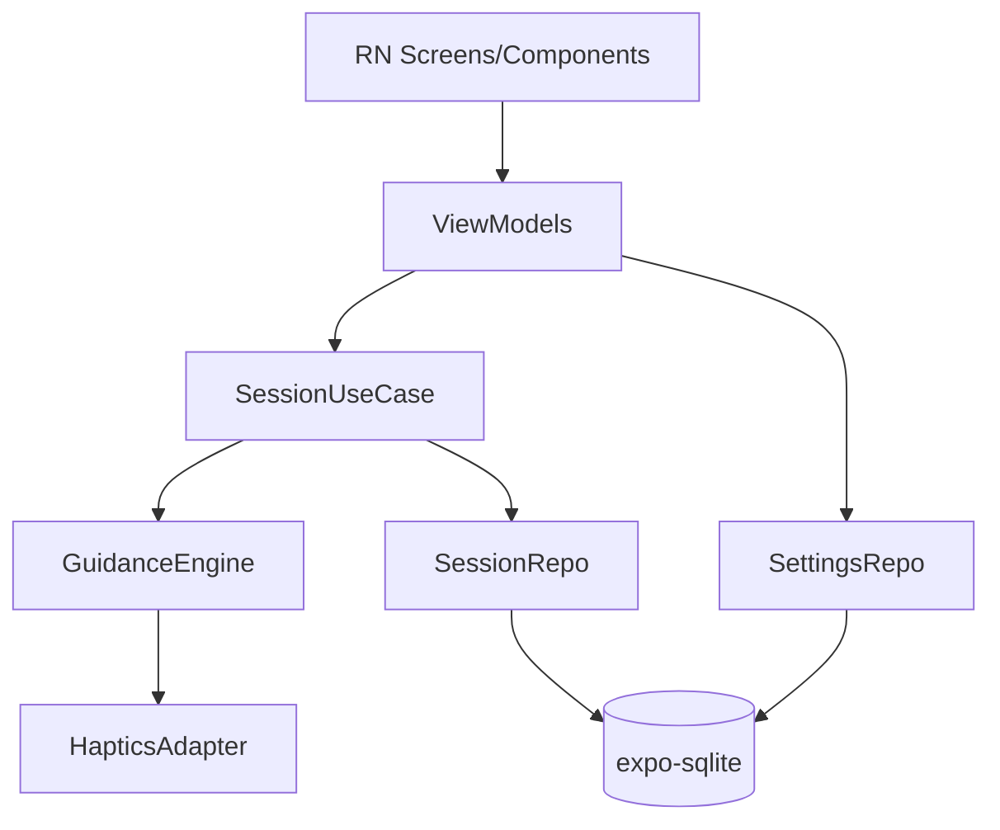
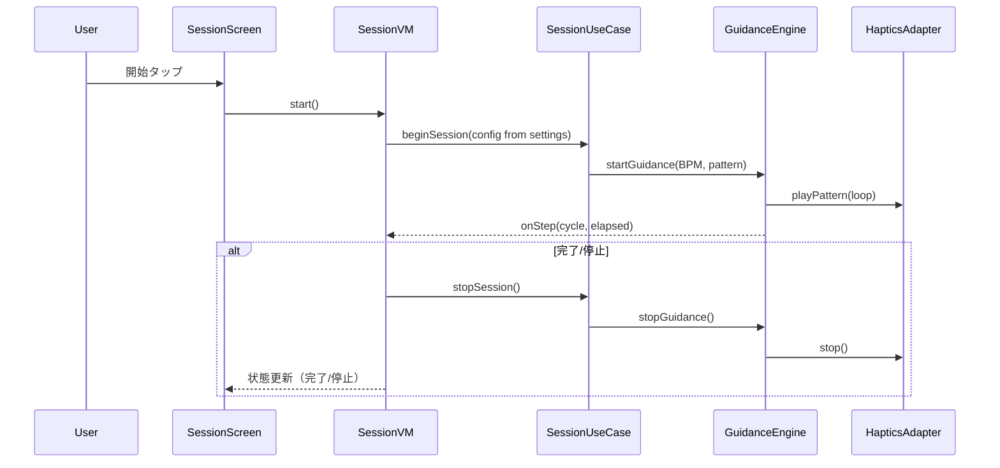

# Design Document

## Overview
本機能は不安や動揺で鼓動が高まったときに、ユーザーが指定したBPMリズムで振動ガイドを即時開始し、身体をリズムに同期させて落ち着きを取り戻すことを主目的とする。視覚ガイド（円の鼓動アニメ）は任意で振動と同期表示し、呼吸テンポプリセットは補助として選択できる。心拍は手入力のみで記録し、履歴を端末ローカルに保存・参照する。

### Goals
- 振動リズム（BPM）を設定・保存し、±5%以内の間隔で継続振動を提供する。
- ワンタップで振動ガイドを開始/停止し、任意で視覚ガイドを同期表示する。
- セッション前後の心拍・主観評価・ガイド種別をローカルに記録・閲覧できる。

### Non-Goals
- 自動心拍計測や外部デバイス連携。
- 長時間バックグラウンド実行（Expo Go / Development Build では非対応）。画面ON/前面前提。
- クラウド同期・共有。

## Architecture

### Architecture Pattern & Boundary Map
選択パターン: MVVM + UseCase + Repository。UIはReact Native (Expo)、ドメインはGuidanceEngine/UseCase、データはSQLite、プラットフォームAPI差異はHapticsAdapterで隔離。



### Technology Stack
| Layer | Choice / Version | Role | Notes |
|-------|------------------|------|-------|
| Frontend | React Native + Expo (Go/Dev Build), TypeScript | 画面・アニメ・入力 | expo-router, Animated |
| Domain | TypeScript | GuidanceEngine, SessionUseCase | タイマー補正で±5%を目標 |
| Data | expo-sqlite | 設定・履歴永続化 | Webはメモリフォールバック |
| Platform | expo-haptics | 振動実行 | Webはダミー |
| Infra | expo-keep-awake | スリープ防止 | 画面ON前提 |

## System Flows

### セッション開始〜停止（振動ガイド優先）


## Requirements Traceability
| Requirement | Summary | Components | Interfaces | Flows |
|-------------|---------|------------|------------|-------|
| 1.1 | BPM入力/スライダー保存 | SettingsScreen, SettingsVM, SettingsRepo | SettingsRepository | - |
| 1.2 | 強度保存 | SettingsScreen, SettingsVM, SettingsRepo | SettingsRepository | - |
| 1.3 | プレビューで単発振動を確認 | SettingsScreen, HapticsAdapter | HapticsAdapter | - |
| 1.4 | 次回自動適用 | SettingsVM | SettingsRepository | - |
| 1.5 | セッション時間設定 | SettingsScreen, SettingsVM, SettingsRepo | SettingsRepository | - |
| 2.1 | 即時開始（振動優先、視覚切替） | SessionScreen/VM, SessionUseCase | SessionUseCase | セッション開始 |
| 2.2 | BPM±5%で継続振動 | GuidanceEngine, HapticsAdapter | GuidanceEngine.startGuidance | セッション進行 |
| 2.3 | 視覚ガイド同期・任意OFF | BreathVisualGuide, SessionVM | - | セッション進行 |
| 2.4 | 確実停止と終了表示（時間/手動） | SessionUseCase, GuidanceEngine | GuidanceEngine.stopGuidance | セッション完了 |
| 3.1 | 呼吸テンポ保存 | SettingsScreen, SettingsRepo | SettingsRepository | - |
| 3.2 | 呼吸有効時の同期提示 | SessionUseCase, GuidanceEngine | SessionUseCase | セッション開始 |
| 3.3 | 呼吸OFFで振動のみ | SessionUseCase | SessionUseCase | セッション開始 |
| 4.1-4.6 | 記録・履歴表示 | SessionUseCase, SessionRepo, LogsScreen/VM | SessionRepository | 記録保存/閲覧 |

## Components & Interfaces

| Component | Layer | Intent | Req | Dependencies | Contracts |
|-----------|-------|--------|-----|--------------|-----------|
| SettingsRepository | Data | BPM/強度/呼吸テンポ/セッション時間の保存/取得 | 1.1-1.5,3.1 | expo-sqlite (P0) | Service, State |
| SessionRepository | Data | セッション記録の保存/取得 | 4.1-4.6 | expo-sqlite (P0) | Service, State |
| HapticsAdapter | Platform | 振動実行と停止、失敗理由の通知 | 1.3,2.2 | expo-haptics (P0) | Service |
| GuidanceEngine | Domain | BPMベースのパルス生成・進行管理 | 2.1-2.4 | HapticsAdapter (P0) | Service |
| SessionUseCase | Domain | 開始/停止オーケストレーション、ガイド選択 | 2.1-2.4,3.2,3.3,4.1-4.3 | GuidanceEngine, SessionRepository, SettingsRepository (P0) | Service |
| SessionViewModel | Presentation | UI状態管理（開始/停止/進行表示） | 2.1-2.4 | SessionUseCase (P0) | State |
| BreathVisualGuide | Presentation | 振動/呼吸周期に同期した円アニメ | 2.3,3.2 | SessionViewModel (P1) | State |
| SettingsViewModel | Presentation | 設定CRUDとプレビュー | 1.1-1.4,3.1 | SettingsRepository, HapticsAdapter (P0) | State |
| LogsViewModel | Presentation | 履歴一覧/詳細取得 | 4.6 | SessionRepository (P0) | State |

### SettingsRepository (Data)
| Field | Detail |
|-------|--------|
| Intent | 振動BPM/強度/呼吸テンポ/セッション時間の保存と取得 |
| Requirements | 1.1,1.2,1.4,1.5,3.1 |
| Contracts | Service, State |
| Outbound | expo-sqlite (P0) |

**Service Interface**
```ts
interface SettingsValues {
  bpm: number; // 40-90
  intensity: 'low'|'medium'|'strong';
  breathPreset: '4-6-4'|'5-5-5'|'4-4-4';
  useBreath: boolean;
  durationSec: number; // 60-300
}
interface SettingsRepository {
  get(): Promise<SettingsValues>;
  save(values: SettingsValues): Promise<void>;
}
```

### HapticsAdapter (Platform)
| Field | Detail |
|-------|--------|
| Intent | 振動パターン実行・停止、失敗理由の通知 |
| Requirements | 1.3,2.2 |
| Contracts | Service |

**Service Interface**
```ts
type HapticsResult = { ok: true } | { ok: false; error: 'permission'|'disabled'|'unknown' };
interface HapticsAdapter {
  play(pattern: number[], amplitudes?: number[]): Promise<HapticsResult>;
  stop(): Promise<HapticsResult>;
}
```
- Validation: pattern長とamplitudes長一致、空配列不可。
- Fallback: 失敗時はエラーを返し、上位で視覚のみ継続。

### GuidanceEngine (Domain)
| Field | Detail |
|-------|--------|
| Intent | BPM間隔で振動を継続し、視覚同期用ステップを通知 |
| Requirements | 2.1,2.2,2.3,2.4 |
| Contracts | Service |

**Service Interface**
```ts
interface GuidanceConfig {
  bpm: number; // 40-90
  pattern: number[]; // ms配列（通常は [0] の単発）
  durationSec: number; // settings.durationSec を使用（初期値180）
  visualEnabled: boolean;
  breathPreset?: '4-6-4'|'5-5-5'|'4-4-4';
}
interface GuidanceListener {
  onStep?: (cycle: number, elapsedSec: number) => void;
  onComplete?: () => void;
  onStop?: () => void;
}
interface GuidanceEngine {
  start(config: GuidanceConfig, listener?: GuidanceListener): Promise<{ ok: boolean; error?: string }>;
  stop(): Promise<void>;
  isActive(): boolean;
}
```
- Behavior: 60000/bpm でタイマー設定、遅延は次周期で補正。±5%目標。
- Invariants: 単一アクティブ、停止時にタイマー全解除。
- Timing note: `setInterval`遅延を計測し、次周期の予定時刻からドリフト分を差し引いてスケジュールする簡易補正を行う。

### SessionUseCase (Domain)
| Field | Detail |
|-------|--------|
| Intent | 設定読込→Guidance開始/停止、終了時の記録保存 |
| Requirements | 2.1-2.4,3.2,3.3,4.1-4.3 |
| Contracts | Service |

**Service Interface**
```ts
interface StartInput { mode: 'VIBRATION'|'BREATH'|'BOTH'; }
interface CompleteInput {
  preHr?: number;
  postHr?: number;
  guideType: 'VIBRATION'|'BREATH'|'BOTH';
  comfort?: number;
  improvement?: number;
}
interface SessionUseCase {
  start(input: StartInput): Promise<{ ok: boolean; error?: string }>;
  stop(): Promise<void>;
  complete(input: CompleteInput): Promise<void>;
}
```
- Behavior: startでSettingsを取得しGuidanceEngineを起動。mode=BOTHなら視覚ON＋振動、BREATHなら視覚のみ・振動OFF。durationSecは設定値（初期値180秒）を使用。
- Stop条件: durationSec経過またはユーザー手動停止の早い方。停止時はGuidanceEngine.stop()を呼び、状態を終了に更新。
- On complete: SessionRepositoryへ記録を保存。

### SessionRepository (Data)
| Field | Detail |
|-------|--------|
| Intent | セッション記録の保存/取得 |
| Requirements | 4.1-4.6 |
| Contracts | Service, State |

**Data Model (Logical / SQLite)**
- `session_records`(id PK, startedAt, endedAt, bpm INT, pattern TEXT, guideType TEXT, preHr INT?, postHr INT?, comfort INT?, improvement INT?, useBreath INT, breathPreset TEXT?, notes TEXT?)
- Index: startedAt DESC

### ViewModels / UI
- **SettingsViewModel/Screen**: BPMスライダー、パターン・強度選択、呼吸ON/OFF、プリセット選択、プレビューでHapticsAdapterをパターン反映（Req 1.1-1.3,3.1）。
- **SessionViewModel/Screen**: モード選択（振動/呼吸/併用）、開始/停止、状態表示、視覚ガイド切替（Req 2.1-2.4,3.2,3.3）。
- **BreathVisualGuide**: 振動/呼吸周期に同期した円アニメ（Req 2.3）。
- **LogsViewModel/Screens**: 履歴一覧/詳細（Req 4.1-4.6）。

## Data Models

### Domain Model
- `GuidanceSettings`: bpm, intensity, durationSec, useBreath, breathPreset。
- `SessionRecord`: id, startedAt, endedAt, bpm, patternId, guideType, preHr?, postHr?, comfort?, improvement?, useBreath, breathPreset?, notes?.

### Logical Data Model
- テーブル: `settings`(id=1, bpm INT, intensity TEXT, durationSec INT, useBreath INT, breathPreset TEXT, updatedAt TEXT)
- テーブル: `session_records`(上記定義)
- 一貫性: 単一設定行をupsert。セッション保存はトランザクションで1件単位。

## Error Handling
- 振動不可（permission/disabled）: GuidanceEngineがエラーを返し、UIは視覚ガイドのみ継続＋警告表示。
- タイマー遅延: GuidanceEngineが補正するが±5%超は警告ログ。
- DB失敗: リトライ1回、失敗時はユーザーへ保存不可を通知（セッション完了は維持）。

## Testing Strategy
- Unit: GuidanceEngineのBPM間隔補正と停止、HapticsAdapterの入力検証、SettingsRepository upsert、SessionUseCase開始/停止/記録保存。
- Integration: 設定保存→セッション開始（振動のみ/呼吸のみ/併用）→停止→記録保存→履歴表示。
- UI: Settingsプレビューでパターン反映、Session開始/停止の状態遷移、履歴一覧表示。

## Performance & Scalability
- タイマー精度: ±5%以内を目標。セッション長は数分以内を推奨し、UIで上限を設定。
- DB規模: 端末ローカルのみ、インデックスは startedAt DESC のみで十分。

## Security Considerations
- データは端末ローカルのみ保存。ネットワーク送信なし。
- 入力心拍は任意、個人識別情報は保持しない。
