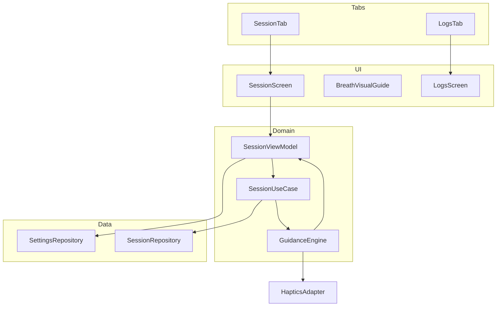
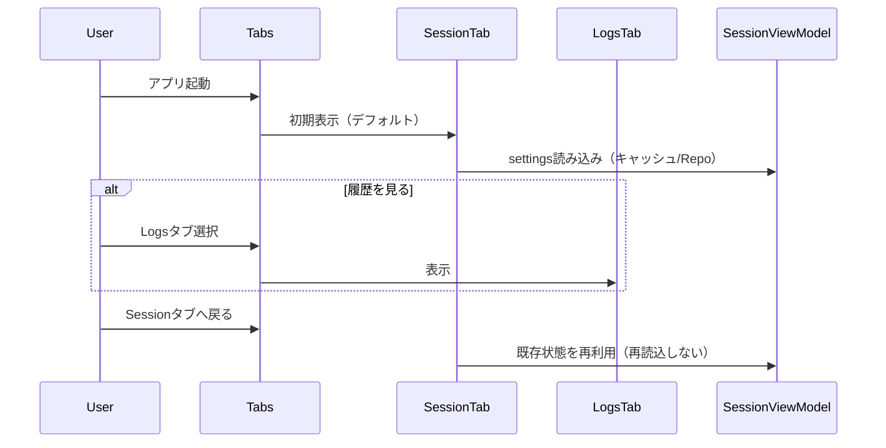
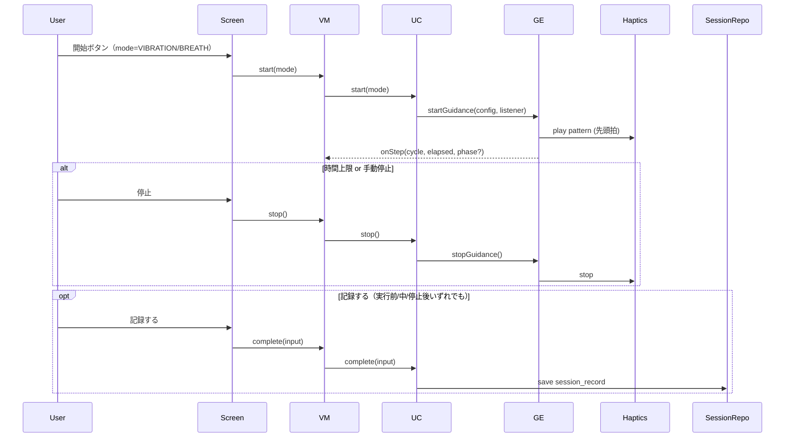

# デザインドキュメント

---
**Purpose**: 心拍/呼吸ガイドを即時開始できるセッション体験を軸に、2タブ（セッション/履歴）へ再編し、設定・ガイド実行・記録をシンプルに運用できるようにする。
**Approach**: 既存の MVVM + UseCase + Repository を踏襲し、プレビュー廃止後の開始/停止フローとタブ構成を再設計する。
---

## Overview
本機能は、セッション（心拍/呼吸ガイドの開始・停止・設定）と履歴確認を2タブで提供し、発作時でも最少タップでガイドを開始できるようにする。タブ切替でも設定や入力状態を失わず、記録を後から参照できる。

### Goals
- セッションタブでモード選択→開始/停止がワンタップ圏内で完結する。
- 呼吸/心拍ガイドが視覚ガイドと同期し、BPM ±5%目標で実行される。
- 履歴タブで最新順の記録に即アクセスし、データはローカルに保持される。

### Non-Goals
- 自動心拍計測や外部デバイス連携。
- バックグラウンド継続（Expo Go 前面前提）。
- クラウド同期・共有。
- 振動強度（振幅）変更 UI／機能（Expo Go では振幅制御不可のため当面非対応、UIも非表示）。

## Architecture

### Existing Architecture Analysis
- 既存: Expo/React Native + TypeScript、MVVM+UseCase+Repository、expo-sqlite／expo-haptics、Webは `.web.ts` メモリフォールバック。
- 変更点: プレビュー廃止による開始/停止単一路線、タブ再編（セッション/履歴の2タブ）、設定状態をタブ切替で保持するための状態スコープ調整。

### Architecture Pattern & Boundary Map
- パターン: MVVM + UseCase + Repository（継続）。UIはタブ構成でSessionScreen/LogsScreenを分離。ViewModelはタブ間で状態を持続。
- 境界: プレゼンテーション(UI), ドメイン(UseCase, GuidanceEngine), データ(Repositories), プラットフォーム(HapticsAdapter)。



### Technology Stack

| Layer | Choice / Version | Role in Feature | Notes |
|-------|------------------|-----------------|-------|
| Frontend | React Native (Expo) + TypeScript | セッション・履歴UI、タブナビゲーション | expo-router tabs |
| Domain | TypeScript | SessionUseCase, GuidanceEngine | ドリフト補正で±5%目標 |
| Data | expo-sqlite / メモリ(.web) | 設定・履歴保存 | Webはメモリフォールバック |
| Platform | expo-haptics | 振動実行/停止 | Webはノーオペ |
| Infra | expo-keep-awake | スリープ防止 | 画面ON前提 |

## System Flows

### タブ起動〜切替


### ガイド開始〜停止〜記録（記録は任意・実行前/中/停止後に可）


## Requirements Traceability

| Requirement | Summary | Components | Interfaces | Flows |
|-------------|---------|------------|------------|-------|
| 1.1 | BPM保存(40-120) | SessionViewModel, SettingsRepository | SettingsRepository.save/get | 設定 |
| 1.2 | （廃止）振動強度選択は提供しない | - | - | - |
| 1.3 | 開始で即時実行・停止まで継続 | SessionUseCase, GuidanceEngine, HapticsAdapter | GuidanceEngine.start/stop | 開始/停止 |
| 1.4 | 前回設定の自動適用 | SessionViewModel, SettingsRepository | get | 起動時 |
| 1.5 | 時間設定/無制限 | SessionViewModel, SettingsRepository | save/get | 設定 |
| 1.6 | デフォルト復元 | SessionViewModel, SettingsRepository | save/get | 設定 |
| 2.1 | 心拍ガイド開始・視覚同期 | GuidanceEngine, HapticsAdapter, BreathVisualGuide | startGuidance listener | 進行 |
| 2.2 | BPM±5%目標 | GuidanceEngine | startGuidance | 進行 |
| 2.3 | 時間/手動停止で確実終了 | GuidanceEngine, SessionUseCase | stopGuidance | 停止 |
| 2.4 | 呼吸フェーズ同期振動/視覚 | GuidanceEngine, BreathVisualGuide | startGuidance | 進行 |
| 3.1 | 呼吸プリセット保持 | SettingsRepository | save/get | 設定 |
| 3.2 | 呼吸モード開始 | SessionUseCase, GuidanceEngine | startGuidance | 開始 |
| 3.3 | モード独立開始 | SessionUseCase | start | 開始 |
| 4.1-4.5 | 記録と履歴表示 | SessionUseCase, SessionRepository, LogsScreen | complete/save/list | 完了/閲覧 |
| 4.6 | 履歴の追加読み込み | SessionRepository, LogsScreen | listPage | 閲覧 |
| 5.1 | タブを2つに限定 | TabLayout, SessionTab, LogsTab | tabs config | 起動 |
| 5.2 | デフォルトでセッション表示 | TabLayout | tabs initial | 起動 |
| 5.3 | 履歴タブで一覧即表示 | TabLayout, LogsScreen | tabs route | ナビ |
| 5.4 | タブ切替で設定状態保持 | SessionViewModel | state scope | ナビ |

## Components and Interfaces

### サマリー
| Component | Domain/Layer | Intent | Requirements | Dependencies (P0/P1) | Contracts |
|-----------|--------------|--------|--------------|----------------------|-----------|
| TabLayout | UI/Nav | 2タブ構成を定義（Session/Logs） | 5.1-5.3 | SessionScreen(P0), LogsScreen(P0) | State |
| SessionScreen | UI | 設定編集と開始/停止操作 | 1.*,2.*,3.*,5.4 | SessionViewModel(P0) | State |
| LogsScreen | UI | 履歴一覧/詳細表示 | 4.*,5.3 | SessionRepository(P0) | State |
| SessionViewModel | UI/Domain Facade | 設定CRUD・開始/停止中継・状態保持 | 1.*,3.*,4.*,5.4 | SettingsRepository(P0), SessionUseCase(P0) | Service, State |
| GuidanceEngine | Domain | 心拍/呼吸ガイド実行とイベント通知 | 1.3,2.1-2.4,3.2 | HapticsAdapter(P0) | Service |
| SessionUseCase | Domain | 開始/停止/記録保存のオーケストレーション | 1.3,2.1-2.3,3.2,3.3,4.*,5.4 | GuidanceEngine(P0), SettingsRepository(P0), SessionRepository(P0) | Service |
| SettingsRepository | Data | 設定の保存/取得 | 1.1-1.6,3.1 | SQLite/Memory(P0) | Service, State |
| SessionRepository | Data | セッション記録保存/取得 | 4.*,5.3 | SQLite/Memory(P0) | Service, State |
| HapticsAdapter | Platform | 振動実行/停止と結果返却 | 1.3,2.1,2.2,2.4 | expo-haptics(P0) | Service |
| BreathVisualGuide | UI | フェーズに同期した視覚ガイド | 2.1,2.4 | SessionViewModel(P1) | State |

### TabLayout (State)
- **Intent**: タブバーを「Session」「Logs」の2つに限定し、初期表示をSessionにする。
- **Dependencies**: SessionScreen(P0), LogsScreen(P0)
- **Contracts**: State ☑
- **Implementation Notes**
  - `app/(tabs)/_layout.tsx` で `Tabs.Screen` を `name="session"` と `name="logs"` の2つだけに設定し、`initialRouteName="session"` を明示。`detachInactiveScreens={false}` `lazy={false}` を指定してタブ切替時のアンマウントを避ける。
  - 既存の `index.tsx` / `explore.tsx` は削除し、新規に `app/(tabs)/session.tsx` で `SessionScreen` を、`app/(tabs)/logs.tsx` で `LogsScreen` をラップする薄いコンポーネントを配置する。
  - タブアイコン・ラベル: Session=「セッション」(heartbeat系アイコン)、Logs=「履歴」(list系アイコン)。アクセシビリティラベルを各タブに付与。

### SessionViewModel (Service/State)
- **Intent**: 設定CRUD、開始/停止/完了の橋渡し、タブ切替でも設定状態を保持。
- **Responsibilities & Constraints**
  - SettingsRepositoryから初期値取得しローカル状態を保持。タブ切替で再マウントしても状態を失わないよう、VMをシングルトン（例: `sessionViewModel.ts` でインスタンスをexport）とし、`SessionScreen` はそれを参照する。加えて TabLayout 側のアンマウント回避設定で二重にリスクを減らす。
  - start/stop/completeをSessionUseCaseに委譲し、結果をUIへ反映。
- **Dependencies**: SettingsRepository(P0), SessionUseCase(P0)
- **Contracts**: Service ☑, State ☑
```typescript
interface SessionViewModel {
  load(): Promise<SettingsValues>;
  update(values: Partial<SettingsValues>): void;
  start(mode: 'VIBRATION'|'BREATH'): Promise<Result>;
  stop(): Promise<Result>;
  complete(input: CompleteInput): Promise<Result>;
  getState(): { settings: SettingsValues; mode: 'VIBRATION'|'BREATH' };
}
```
- **Notes**: タブ切替で状態保持するため、VMインスタンスをタブの外側で提供（context/singleton）。

### GuidanceEngine (Service)
- **Intent**: 振動/呼吸ガイドのタイミング管理とリスナー通知。
- **Responsibilities**: BPM間隔で単発振動（±5%目標）、呼吸フェーズ進行（inhale/hold/exhale, cycles）、onStep/onComplete/onStop通知、単一アクティブ。
- **Contracts**: Service ☑
```typescript
interface GuidanceConfig {
  mode: 'VIBRATION' | 'BREATH';
  bpm?: number;
  vibrationPattern?: number[];
  durationSec?: number | null;
  breath?: { inhaleMs: number; holdMs?: number; exhaleMs: number; cycles: number|null; haptics?: { pattern: number[] } };
}
interface GuidanceListener {
  onStep?: (step: { cycle: number; elapsedSec: number; phase?: 'INHALE'|'HOLD'|'EXHALE'|'PULSE' }) => void;
  onComplete?: () => void;
  onStop?: () => void;
}
interface GuidanceEngine {
  startGuidance(config: GuidanceConfig, listener?: GuidanceListener): Promise<Result>;
  stopGuidance(): Promise<Result>;
  isActive(): boolean;
}
```
- **Preconditions**: durationSec が指定されている場合は > 0, VIBRATION時 bpm 40-120, 呼吸フェーズ秒数は正数。
- **Implementation Notes**: 計画時刻を累積しドリフト補正。durationSec が null/未指定の場合は終了タイマーを作らず、停止操作のみで終了する。cycles=null は durationSec がある場合のみ上限として扱う。Webでは play 失敗でも {ok:true} を返し継続。

### SessionUseCase (Service)
- **Intent**: 設定取得→Guidance開始/停止→完了データ保存のオーケストレーション。
- **Contracts**: Service ☑
```typescript
type StartInput = { mode: 'VIBRATION'|'BREATH' };
type CompleteInput = {
  preHr?: number; postHr?: number; guideType: 'VIBRATION'|'BREATH';
  improvement?: number; breath?: BreathPattern; bpm?: number;
};
interface SessionUseCase {
  start(input: StartInput): Promise<Result>;
  stop(): Promise<Result>;
  complete(input: CompleteInput): Promise<Result>;
}
```
- **Invariants**: startは非アクティブ時のみ。completeは実行前/中/停止後のいずれでも可能。breath cycles null=∞ は手動停止またはdurationで終了（durationSecが未指定の場合は手動停止のみ）。
- **Notes**: stop時はGuidanceEngine.stopをawait。保存失敗はResultで返しUIリトライへ。

### SettingsRepository (Service/State)
- **Intent**: BPM/時間・呼吸パターンの保存/取得。
- **Contracts**:
```typescript
interface SettingsRepository {
  get(): Promise<SettingsValues>;
  save(values: SettingsValues): Promise<Result>;
}
```
- **Validation**: bpm 40-120, durationSec 60-300 or null, cycles 正数 or null。

### SessionRepository (Service/State)
- **Intent**: セッション記録の保存と取得。
- **Contracts**:
```typescript
type SessionRecord = {
  id: string;
  recordedAt: string;
  startedAt?: string | null;
  endedAt?: string | null;
  guideType: 'VIBRATION'|'BREATH';
  bpm?: number;
  preHr?: number;
  postHr?: number;
  improvement?: number;
  breathConfig?: BreathPattern;
};
interface SessionRepository {
  save(record: SessionRecord): Promise<Result>;
  list(order?: 'asc'|'desc'): Promise<SessionRecord[]>; // default: 'desc' (recordedAt)
  listPage(input: {
    limit: number;
    cursor?: { recordedAt: string; id: string } | null;
  }): Promise<{
    records: SessionRecord[];
    nextCursor?: { recordedAt: string; id: string } | null;
    hasNext: boolean;
  }>;
  get(id: string): Promise<SessionRecord | null>;
}
```
- **Notes**: recordedAt DESC + id DESCインデックスで安定ソート。cursorは(recordedAt,id)で保持。breathConfigはJSON文字列で永続化。

### Tab/Logs UI Components (State)
- **LogsScreen**: 初回は「表示されたタイミング（初回フォーカス時）」に `SessionRepository.listPage` から最新分を取得し、recordedAt 降順で表示（UI側で追加ソートはしない）。タブ再表示時は自動で再取得せず、表示内容を維持する。`onEndReached` で追加ページを取得し、既存リストに追記する。Pull-to-Refresh を実装し、更新時は最新1ページ分を再取得して既存一覧に重複なく先頭追加する（ページングのcursorは維持）。空表示時でも Pull-to-Refresh を実行できるようにする。タップで詳細へ（既存ログUIを流用/拡張）。
- **State保持**: タブ切替時に再マウントで状態が失われないよう、tabs 配下コンポーネントのアンマウントを避けるか、VM/Storeに集約。

## Data Models

### Domain Model
- GuidanceSettings: bpm, durationSec, breath(BreathPattern)。
- SessionRecord: id, recordedAt, startedAt?, endedAt?, guideType, bpm?, breathConfig?, pre/postHr?, improvement?.
- Invariants: cycles null=∞、durationSec null/未指定=∞（手動停止必須）。

### Logical Data Model
- `settings`(id=1, bpm INT, durationSec INT NULL, breathType TEXT, inhaleSec INT, holdSec INT NULL, exhaleSec INT, breathCycles INT NULL, updatedAt TEXT)
- `session_records`(id PK, recordedAt TEXT, startedAt TEXT NULL, endedAt TEXT NULL, guideType TEXT, bpm INT NULL, preHr INT NULL, postHr INT NULL, improvement INT NULL, breathConfig TEXT NULL, notes TEXT NULL)
- Index: recordedAt DESC, id DESC。

## Error Handling
- ユーザーエラー: 入力範囲外(BPM/時間/cycles/heart rate)はUIバリデーションでブロック。
- システムエラー: Haptics permission/disabled は Resultで返し視覚のみ継続。DB失敗は1回リトライし失敗時に再試行案内。
- ビジネスロジック: start中の重複startは {ok:false, error:'already_running'}。
- 監視: ガイド開始/停止、保存失敗をログ出力。

## Testing Strategy
- Unit: GuidanceEngine（BPMドリフト補正、呼吸フェーズ進行、cycles∞/有限、停止）、HapticsAdapter入力検証、SettingsRepository境界値、SessionUseCase start/stop/complete、SessionViewModel状態保持（タブ切替シミュレーション）。
- Integration/UI: セッションタブ初期表示→設定編集→開始/停止→記録保存、タブ切替で設定保持、履歴タブで一覧即表示、振動不可時に視覚のみ継続。
- E2E: Android/Expo Go でセッション開始→停止→記録入力→履歴確認。Webで振動不可でも落ちないこと。
