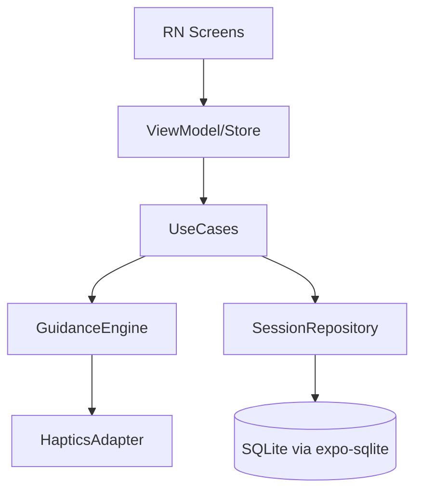
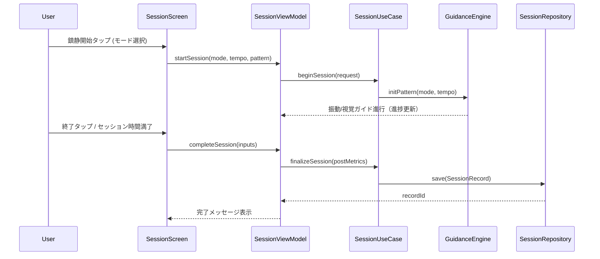

# Design Document

## Overview
本機能は急激な高ぶり時に、呼吸ガイド（視覚アニメーション）とリズム振動で短時間の鎮静体験を提供し、セッション前後の状態を手入力で記録・振り返りできるようにする。対象プラットフォームはAndroidのみで、**Expo Go / Development Build（prebuild/CNGでネイティブ生成可能）で素早く実装し、必要に応じて完全ネイティブ化に移行しやすい構成**を前提にする（オフライン完結）。

### Goals
- 呼吸ガイド/振動ガイドを端末単体で安定提供する。
- 事前設定（テンポ・バイブ強度/リズム）を保存し再利用する。
- セッション前後の心拍・主観評価・ガイド種別をローカルに記録し閲覧可能にする。

### Non-Goals
- iOS対応やクロスプラットフォーム実装。
- 心拍の自動計測・外部デバイス同期。
- クラウド同期や共有機能。
- ネイティブForeground Service等による長時間バックグラウンド連続実行（現状は画面ON/前面滞在を前提。必要になればprebuild/CNG後に追加）。

## Architecture

### Architecture Pattern & Boundary Map
選択パターン: MVVM + UseCase + Repository。UIはReact Native (Expo)、ドメインはユースケースとガイドエンジン、データはローカルDBに分離し、端末API差異はアダプタで隔離する。将来prebuild/CNGでネイティブプロジェクトを生成しても、この層構造を維持しPlatform層だけ差し替えられるようにする。



### Technology Stack
| Layer | Choice | Role in Feature | Notes |
|-------|--------|-----------------|-------|
| Frontend | React Native + Expo (Go/Development Build) + TypeScript | 設定/セッション/履歴UI、視覚呼吸アニメーション | expo-router or standard navigation, Hooksベース状態管理、Reanimated/Animated |
| Domain | TypeScript (UseCase/GuidanceEngine) | 手順管理・パターン生成 | 一方向依存、テスト容易性を維持 |
| Data | expo-sqlite (SQLite) | 設定・セッション履歴のローカル永続化 | オフライン完結、軽量スキーマ |
| Platform | expo-haptics | 振動ガイド実行 | 端末APIをJSからラップ |
| Infra/Runtime | Expo Go / Development Build Runtime | ビルド/EAS、権限管理 | バックグラウンド常駐は限定的（画面ON前提、prebuild/CNG後に拡張可） |

## System Flows

### セッション開始〜終了シーケンス


## Requirements Traceability

| Requirement | Summary | Components | Interfaces | Flows |
|-------------|---------|------------|------------|-------|
| 1.1–1.4 | 個人設定の保存/プレビュー/自動反映 | SettingsRepository, SettingsViewModel, SettingsScreen | SettingsRepository, SettingsDAO | なし（単純操作） |
| 2.1–2.5 | ガイド開始・提示・静音対応・終了 | SessionViewModel, SessionUseCase, GuidanceEngine, HapticsAdapter, SessionScreen | GuidanceEngineContract, HapticsAdapterContract | セッションシーケンス |
| 3.1–3.6 | 前後心拍・ガイド種別・体感・改善度の記録と履歴閲覧 | SessionRepository, SessionLogListViewModel, LogListScreen, SessionDetailView | SessionRepository (DAO), SessionRecord | セッションシーケンス |

## Components & Interfaces

### コンポーネントサマリ
| Component | Domain/Layer | Intent | Req Coverage | Key Dependencies | Contracts |
|-----------|--------------|--------|--------------|------------------|-----------|
| SettingsRepository | Data | 設定の保存/取得 | 1.1-1.4 | expo-sqlite (P0) | Service, State |
| SessionRepository | Data | セッション記録の保存/取得 | 3.1-3.6 | expo-sqlite (P0) | Service, State |
| GuidanceEngine | Domain | ガイドパターン生成と進行管理 | 2.1-2.5 | HapticsAdapter(P0) | Service |
| HapticsAdapter | Platform | 端末振動API抽象化 | 2.2-2.5 | expo-haptics(P0) | Service |
| SessionUseCase | Domain | セッション開始/完了のオーケストレーション | 2.1-2.5, 3.1-3.6 | GuidanceEngine(P0), SessionRepository(P0) | Service |
| SessionViewModel | Presentation | セッションUI状態管理 | 2.1-2.5, 3.1-3.6 | SessionUseCase(P0) | State |
| BreathVisualGuide | Presentation | 視覚呼吸アニメーション表示 | 2.2-2.4 | SessionViewModel(P0) | State |
| SettingsViewModel | Presentation | 設定UI状態管理 | 1.1-1.4 | SettingsRepository(P0) | State |
| SessionLogListViewModel | Presentation | 履歴一覧/詳細の取得 | 3.6 | SessionRepository(P0) | State |
| ForegroundGuidanceService | Platform | 採用しない（Expo Go / Development Build の制約） | — | — | — |

### GuidanceEngine (Domain)
| Field | Detail |
|-------|--------|
| Intent | ガイドパターン生成と進行、モード別制御 |
| Requirements | 2.1, 2.2, 2.3, 2.4, 2.5 |

**Responsibilities & Constraints**
- ガイドモード（視覚呼吸／振動のみ）に応じてパターンを生成。
- セッション時間とテンポに基づき、タイマーでステップ実行し、視覚アニメ進捗と振動トリガーを同期。

**Dependencies**
- Outbound: HapticsAdapter (P0) — パターン振動実行。

**Contracts**: Service ✅
```ts
type GuidanceMode = 'BREATH' | 'VIBRATION'

type GuidanceConfig = {
  mode: GuidanceMode;
  tempo: TempoPreset;
  durationSec: number;
  vibrationPattern?: VibrationPattern;
}

interface GuidanceEngine {
  startGuidance(config: GuidanceConfig): Promise<Result<void>>;
  stopGuidance(): Promise<Result<void>>;
}
```
- Preconditions: `durationSec > 0`、振動権限が有効。
- Postconditions: セッション終了時にガイド停止、状態を初期化。
- Invariants: 単一アクティブセッションのみ。

**Implementation Notes**
- Integration: setInterval/タイマーでパターン進行、UIへstate更新（hook/Store）。
- Validation: 入力テンポとパターンの組合せを事前検証。
- Risks: 端末設定で振動無効 → 視覚ガイドのみを継続し、ログに原因を残す。

### HapticsAdapter (Platform)
| Field | Detail |
|-------|--------|
| Intent | 振動API差異の吸収と失敗時フォールバック |
| Requirements | 2.2, 2.3, 2.4 |

**Responsibilities & Constraints**
- `expo-haptics` を介してパターン振動を実行（ネイティブAPI直接呼び出しは行わない）。
- 無音モードでも可能な限り振動を実行し、失敗時は理由を返す。

**Contracts**: Service ✅
```ts
interface HapticsAdapter {
  play(patternMs: number[], amplitudes?: number[], repeat?: number): Result<void>;
  stop(): Result<void>;
}
```

**Implementation Notes**
- Integration: パターンは`GuidanceEngine`が生成し、このアダプタで実行。
- Validation: パターン長・amplitude長の整合性をチェック。
- Risks: 権限なし/設定無効時の例外をResultで返却しUI通知。

### SessionUseCase (Domain)
| Field | Detail |
|-------|--------|
| Intent | セッション開始/完了のオーケストレーション |
| Requirements | 2.1-2.5, 3.1-3.6 |

**Responsibilities & Constraints**
- 事前設定とユーザー入力をマージして`GuidanceConfig`を生成。
- 前後心拍・主観評価・改善度を`SessionRepository`へ保存。
- 画面ON前提のタイマー進行を開始/停止（Foreground Serviceはスコープ外。prebuild/CNG後に追加検討）。

**Contracts**: Service ✅
```ts
interface SessionUseCase {
  beginSession(request: StartSessionRequest): Promise<Result<ActiveSession>>;
  completeSession(input: CompleteSessionInput): Promise<Result<SessionRecordId>>;
}
```

### SessionRepository (Data)
**Contracts**: Service, State ✅
```ts
interface SessionRepository {
  save(record: SessionRecord): Promise<SessionRecordId>;
  streamAll(): Promise<SessionRecord[]>; // シンプルに全件取得（必要に応じてsubscribeラッパを追加）
  find(id: SessionRecordId): Promise<SessionRecord | null>;
}
```

**Data Ownership**: セッション記録（前後心拍、ガイド種別、体感、改善度、タイムスタンプ）。

### SettingsRepository (Data)
保存/取得、プレビュー用設定を返却。Req 1.1-1.4。

### ViewModels & UI Screens (Presentation)
- SettingsViewModel / SettingsScreen: 設定CRUDとプレビュー。
- SessionViewModel / SessionScreen: モード選択、開始/停止、進行表示（BreathVisualGuideへのテンポ・進捗提供）。
- BreathVisualGuide: 呼吸テンポに同期した円の拡大縮小などの視覚アニメを描画。
- SessionLogListViewModel / LogListScreen / LogDetailView: 履歴一覧と詳細表示。

### ForegroundGuidanceService (Platform)
- 役割: **Expo Go / Development Buildでは常駐サービスが使えないため採用しない。** 代わりに画面ON・アプリ前面を前提とし、必要なら`expo-keep-awake`でセッション中のスリープを防ぐ。
- 契約: なし（非採用）。

## Data Models

### Domain Model
- `GuidanceSettings`: tempoプリセット、バイブ強度/リズム。
- `GuidanceMode`: 呼吸/振動。
- `SessionRecord`: id, startedAt, endedAt, preHr?, postHr?, mode, tempo, patternId, comfortScore, vibrationFeel, calmnessScore, improvementScore(5段階)。

### Logical Data Model
  - テーブル: `settings`(id=singleton, tempoPreset, vibrationStrength, vibrationPatternId, updatedAt)
  - テーブル: `session_records`(id PK, startedAt, endedAt, preHr INT?, postHr INT?, mode TEXT, tempoPreset TEXT, patternId TEXT, comfortScore INT?, vibrationFeel INT?, calmnessScore INT?, improvementScore INT?, notes TEXT?)
  - インデックス: startedAt DESC (履歴一覧用)

## Error Handling
- 権限不足/振動不可: HapticsAdapterがResultで返却し、UIにフォールバックと警告を表示（視覚ガイドのみ継続）。
- DB書き込み失敗: 再試行して失敗時はユーザーに保存不可を通知（セッション終了は維持）。

## Testing Strategy
- Unit: GuidanceEngineパターン生成、HapticsAdapter入力検証、SessionUseCaseの前後心拍保存。
- Integration: HapticsAdapterの実行結果、SQLite DAOでの保存/取得。
- UI/E2E: セッション開始→視覚/振動ガイド提示→終了→記録保存→履歴表示のハッピーパス、振動不可端末のフォールバック確認。

## Security Considerations
- 端末内のみ保存し、ネットワーク送信なし。
- 通知には個人データを含めない。
- 任意入力の心拍は端末ローカルに留め、エクスポート機能を提供しない（現スコープ外）。

## Performance & Scalability
- セッションは短時間・少量データのためメモリ/DB負荷は軽微。
- 振動と視覚アニメはUIスレッドをブロックしないよう非同期実行（Promise/アニメーションドライバ）。

## Supporting References
- 詳細なAPI差異や端末ごとの挙動は `research.md` を参照。
