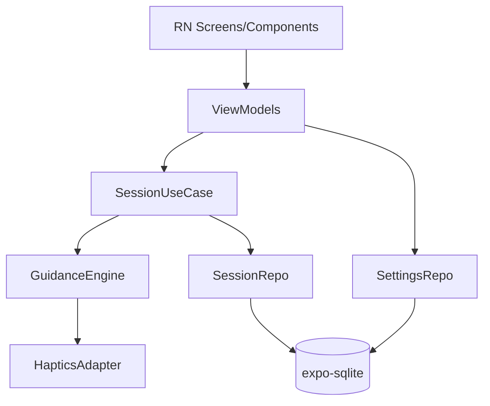
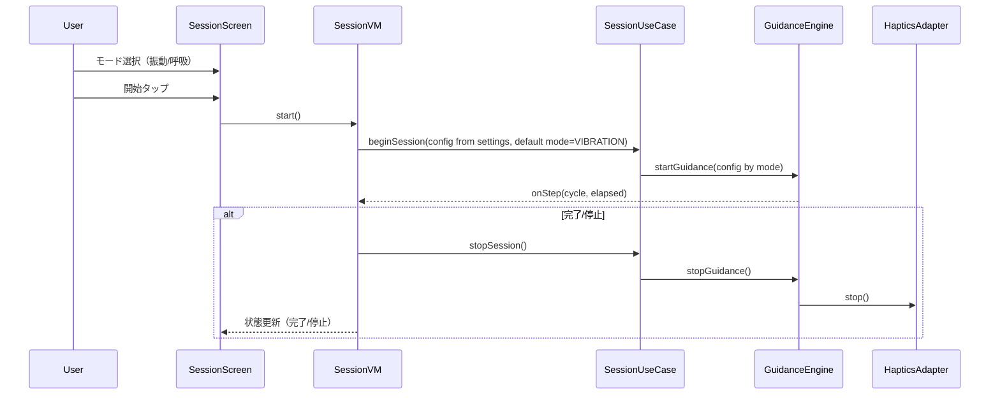

# Design Document

## Overview
本機能は不安や動揺で鼓動が高まったときに、ユーザーが指定したBPMリズムで「1拍1振動」を即時開始し呼吸ペースを整えることを目的とする。呼吸ガイドは2フェーズ（吸う/吐く）または3フェーズ（吸う/止める/吐く）の秒数とサイクル回数を設定でき、振動モードと切り替えて利用する。心拍は手入力のみで記録し、履歴を端末ローカルに保存・参照する。

### Goals
- 振動リズム（BPM）を設定・保存し、±5%以内の間隔で「1拍1振動」を提供する。
- 呼吸ガイドはフェーズ秒数（2/3フェーズ）とサイクル回数を設定し、振動モードと切替可能にする。
- セッション前後の心拍・主観評価・ガイド種別をローカルに記録・閲覧できる。

### Non-Goals
- 自動心拍計測や外部デバイス連携。
- 長時間バックグラウンド実行（Expo Go / Development Build では非対応）。画面ON/前面前提。
- クラウド同期・共有。

## Architecture

### Architecture Pattern & Boundary Map
選択パターン: MVVM + UseCase + Repository。UIはReact Native (Expo)、ドメインはGuidanceEngine/UseCase、データはSQLite、プラットフォームAPI差異はHapticsAdapterで隔離。



### Technology Stack
| Layer | Choice / Version | Role | Notes |
|-------|------------------|------|-------|
| Frontend | React Native + Expo (Go/Dev Build), TypeScript | 画面・アニメ・入力 | expo-router, Animated |
| Domain | TypeScript | GuidanceEngine, SessionUseCase | タイマー補正で±5%を目標 |
| Data | expo-sqlite | 設定・履歴永続化 | Webはメモリフォールバック |
| Platform | expo-haptics | 振動実行 | Webはダミー |
| Infra | expo-keep-awake | スリープ防止 | 画面ON前提 |

## System Flows

### セッション開始〜停止（モード切替）


## Requirements Traceability
| Requirement | Summary | Components | Interfaces | Flows |
|-------------|---------|------------|------------|-------|
| 1.1 | BPM入力/スライダー保存（振動設定） | SessionScreen/VM | SettingsRepository | - |
| 1.2 | 強度保存（共通） | SessionScreen/VM | SettingsRepository | - |
| 1.3 | プレビューで単発振動を確認 | SessionScreen/VM | HapticsAdapter | - |
| 1.4 | 次回自動適用 | SessionVM | SettingsRepository | - |
| 1.5 | セッション時間設定＋手動停止 | SessionScreen/VM | SettingsRepository | - |
| 2.1 | デフォルト振動で即時開始、呼吸モードに切替可 | SessionScreen/VM, SessionUseCase | SessionUseCase | セッション開始 |
| 2.2 | BPM±5%で単発振動 | GuidanceEngine, HapticsAdapter | GuidanceEngine.startGuidance | セッション進行 |
| 2.3 | 視覚ガイド同期・任意OFF | BreathVisualGuide, SessionVM | - | セッション進行 |
| 2.4 | 確実停止（時間/手動） | SessionUseCase, GuidanceEngine | GuidanceEngine.stopGuidance | セッション完了 |
| 3.1 | 呼吸プリセット保存（2/3フェーズ秒数・サイクル回数） | SessionScreen/VM | SettingsRepository | - |
| 3.2 | 呼吸のみの開始 | SessionUseCase, GuidanceEngine | SessionUseCase | セッション開始 |
| 3.3 | 振動のみの開始 | SessionUseCase | SessionUseCase | セッション開始 |
| 4.1-4.6 | 記録・履歴表示 | SessionUseCase, SessionRepo, LogsScreen/VM | SessionRepository | 記録保存/閲覧 |

## Components & Interfaces

| Component | Layer | Intent | Req | Dependencies | Contracts |
|-----------|-------|--------|-----|--------------|-----------|
| SettingsRepository | Data | 振動(BPM/時間/強度)＋呼吸フェーズ秒数/サイクル回数の保存・取得 | 1.1-1.5,3.1 | expo-sqlite (P0) | Service, State |
| SessionRepository | Data | セッション記録の保存/取得 | 4.1-4.6 | expo-sqlite (P0) | Service, State |
| HapticsAdapter | Platform | 振動実行と停止、失敗理由の通知 | 1.3,2.2 | expo-haptics (P0) | Service |
| GuidanceEngine | Domain | モードに応じて振動パルスまたは呼吸フェーズ進行を管理し、視覚同期を通知 | 2.1-2.4,3.2 | HapticsAdapter (P0) | Service |
| SessionUseCase | Domain | 設定読込→Guidance開始/停止、終了時の記録保存（振動/呼吸を切替） | 2.1-2.4,3.2,3.3,4.1-4.3 | GuidanceEngine, SessionRepository, SettingsRepository (P0) | Service |
| SessionViewModel | Presentation | 設定CRUD/プレビュー＋開始/停止/進行表示（モード別UI切替） | 1.1-1.5,2.1-2.4,3.1-3.3 | SettingsRepository, HapticsAdapter, SessionUseCase (P0) | State |
| BreathVisualGuide | Presentation | 呼吸/振動周期に同期した円アニメ | 2.3,3.2 | SessionViewModel (P1) | State |
| LogsViewModel | Presentation | 履歴一覧/詳細取得 | 4.6 | SessionRepository (P0) | State |

### SettingsRepository (Data)
| Field | Detail |
|-------|--------|
| Intent | 振動BPM/時間/強度と、呼吸フェーズ秒数・サイクル回数の保存と取得 |
| Requirements | 1.1,1.2,1.4,1.5,3.1 |
| Contracts | Service, State |
| Outbound | expo-sqlite (P0) |

**Service Interface**
```ts
type BreathPattern =
  | { type: 'two-phase'; inhaleSec: number; exhaleSec: number; cycles: number | null }
  | { type: 'three-phase'; inhaleSec: number; holdSec: number; exhaleSec: number; cycles: number | null };

interface SettingsValues {
  bpm: number; // 40-90
  durationSec: number; // 60-300, 手動停止は常に可
  intensity: 'low'|'medium'|'strong'; // 共通
  breath: BreathPattern;
}
interface SettingsRepository {
  get(): Promise<SettingsValues>;
  save(values: SettingsValues): Promise<void>;
}
```

### HapticsAdapter (Platform)
| Field | Detail |
|-------|--------|
| Intent | 振動パターン実行・停止、失敗理由の通知 |
| Requirements | 1.3,2.2 |
| Contracts | Service |

**Service Interface**
```ts
type HapticsResult = { ok: true } | { ok: false; error: 'permission'|'disabled'|'unknown' };
interface HapticsAdapter {
  play(pattern: number[], amplitudes?: number[]): Promise<HapticsResult>;
  stop(): Promise<HapticsResult>;
}
```
- Validation: pattern長とamplitudes長一致。呼吸モードでは振動を出さないため空配列を許容。
- Fallback: 失敗時はエラーを返し、上位で視覚のみ継続。

### GuidanceEngine (Domain)
| Field | Detail |
|-------|--------|
| Intent | モードに応じてBPM間隔の単発振動、または呼吸フェーズパターンを進行し、視覚同期ステップを通知 |
| Requirements | 2.1,2.2,2.3,2.4,3.2 |
| Contracts | Service |

**Service Interface**
```ts
interface GuidanceConfig {
  mode: 'VIBRATION' | 'BREATH';
  bpm?: number; // 振動モードで使用
  vibrationPattern?: number[]; // 振動モード: 通常 [0]
  durationSec: number; // 振動モードの時間 or 呼吸モードの上限時間
  visualEnabled: boolean;
  breath?: {
    inhaleMs: number;
    holdMs?: number;
    exhaleMs: number;
    cycles: number | null; // nullなら∞（手動停止 or durationSecで停止）
  };
}
interface GuidanceListener {
  onStep?: (cycle: number, elapsedSec: number) => void;
  onComplete?: () => void;
  onStop?: () => void;
}
interface GuidanceEngine {
  startGuidance(config: GuidanceConfig, listener?: GuidanceListener): Promise<{ ok: boolean; error?: string }>;
  stopGuidance(): Promise<{ ok: boolean }>;
  isActive(): boolean;
}
```
- Behavior: 振動モードは60000/bpm間隔、呼吸モードはフェーズ秒数に従って inhale→hold→exhale をcycles回繰り返す。cyclesが∞ならdurationSec上限または手動停止で終了。
- Invariants: 単一アクティブ。停止時にタイマー全解除。

### SessionUseCase (Domain)
| Field | Detail |
|-------|--------|
| Intent | 設定読込→Guidance開始/停止、終了時の記録保存（振動/呼吸を切替） |
| Requirements | 2.1-2.4,3.2,3.3,4.1-4.3 |
| Contracts | Service |

**Service Interface**
```ts
interface StartInput { mode: 'VIBRATION'|'BREATH'; }
interface CompleteInput {
  preHr?: number;
  postHr?: number;
  guideType: 'VIBRATION'|'BREATH';
  comfort?: number;
  improvement?: number;
  breath?: BreathPattern;
  bpm?: number;
}
interface SessionUseCase {
  start(input: StartInput): Promise<{ ok: boolean; error?: string }>;
  stop(): Promise<void>;
  complete(input: CompleteInput): Promise<void>;
}
```
- Behavior: startでSettingsを取得しGuidanceEngineを起動。デフォルトmodeは VIBRATION。BREATHでは呼吸フェーズ秒数とサイクルで進行し振動は出さない。durationSecは振動モードの上限、呼吸モードはcyclesで終了、∞の場合はdurationSec上限または手動停止。
- 呼吸モードの終了優先順位: cyclesが0より大きい場合は指定回数完了で終了。cycles=null(∞) の場合は手動停止が最優先、次いでdurationSec上限で終了。
- Stop条件: durationSec経過または手動停止の早い方（呼吸モードはcycles完了でも終了）。停止時はGuidanceEngine.stop()を呼び、状態を終了に更新。
- On complete: guideType、呼吸パターン、BPM、pre/post心拍、comfort、improvementをSessionRepositoryへ保存。

### SessionRepository (Data)
| Field | Detail |
|-------|--------|
| Intent | セッション記録の保存/取得 |
| Requirements | 4.1-4.6 |
| Contracts | Service, State |

**Data Model (Logical / SQLite)**
- `session_records`(id PK, startedAt, endedAt, bpm INT, guideType TEXT, preHr INT?, postHr INT?, comfort INT?, improvement INT?, breathConfig TEXT?, notes TEXT?)
  - breathConfigはJSON文字列で `{type:'two-phase'|'three-phase', inhaleSec, holdSec?, exhaleSec, cycles}` を保存
- Index: startedAt DESC

### ViewModels / UI
- **SessionViewModel/Screen**: モード選択（振動/呼吸）、設定変更（振動: BPM/時間/強度のみ表示・編集、呼吸: 強度＋フェーズ秒数＋サイクルのみ表示・編集）、プレビュー、開始/停止、状態表示、視覚ガイド切替（Req 1.1-1.5,2.1-2.4,3.1-3.3）。
- **BreathVisualGuide**: 振動/呼吸周期に同期した円アニメ（呼吸は膨張/縮小、振動は収縮パルス）（Req 2.3）。
- **LogsViewModel/Screens**: 履歴一覧/詳細（Req 4.1-4.6）。

## Data Models

### Domain Model
- `GuidanceSettings`: bpm, durationSec, intensity, breath (BreathPattern)。
- `SessionRecord`: id, startedAt, endedAt, bpm?, guideType, preHr?, postHr?, comfort?, improvement?, breathConfig?, notes?.

### Logical Data Model
- テーブル: `settings`(id=1, bpm INT, durationSec INT, intensity TEXT, breathType TEXT, inhaleSec INT, holdSec INT NULL, exhaleSec INT, breathCycles INT NULL, updatedAt TEXT)
- テーブル: `session_records`(上記定義)
- 一貫性: `breathCycles` がNULLの場合は∞を表す。`holdSec`はthree-phaseのみ使用。

## Error Handling
- 振動不可（permission/disabled）: GuidanceEngineがエラーを返し、UIは視覚ガイドのみ継続＋警告表示。
- タイマー遅延: GuidanceEngineが補正するが±5%超は警告ログ。長時間利用は非推奨。
- DB失敗: リトライ1回、失敗時はユーザーへ保存不可を通知（セッション完了は維持）。

## Testing Strategy
- Unit: GuidanceEngine（BPM進行、呼吸フェーズ進行、cycles終了、停止）、HapticsAdapter入力検証、SettingsRepository保存/復元、SessionUseCase開始/停止/記録保存。
- Integration: モード別開始（振動/呼吸）→時間/手動停止→記録保存→履歴表示、振動不可時の視覚継続、Webプレビュー無振動で落ちないこと。
- UI: 設定パネルのモード別出し分け、プレビュー（振動パルス/呼吸膨縮）、開始/停止の状態遷移。

## Performance & Scalability
- タイマー精度: ±5%以内を目標。呼吸フェーズは数秒単位で短期セッションを前提にする。
- DB規模: 端末ローカルのみ、startedAt DESC の単一インデックスで十分。

## Security Considerations
- データは端末ローカルのみ保存。ネットワーク送信なし。
- 心拍入力は任意でNULL許容。個人識別情報は保持しない。
