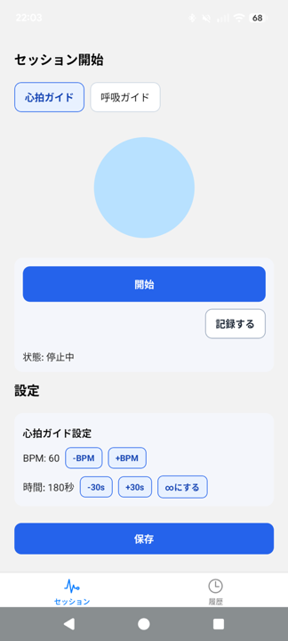
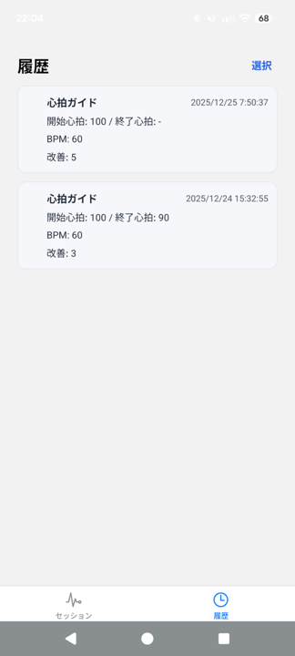

# CalmVibe

心拍ガイド（BPM）/ 呼吸ガイドで、意識を戻すためのモバイルアプリ。

- 心拍ガイド：一定テンポで振動
- 呼吸ガイド：吸う / 止める / 吐く をガイド
- 履歴：セッションを端末内に記録（外部送信なし）

## スクリーンショット




## 作成の動機
不安や動揺時に、呼吸や心拍の基準になるリズムが欲しいと感じて作りました。
ワンタップで普段どおりの状態に戻れる導線を最優先にしています。

## 主要機能
- 心拍ガイド／呼吸ガイドの開始・停止
- 設定の保存と復元
- セッション記録と履歴閲覧

## 動作確認
- Android 16 実機（2026-01-03）

## プライバシー
- データは端末内のみで管理し、外部送信は行いません

## Android（スタンドアロンAPK）
Expo Go を使わずに端末へ直接インストールして動作させる手順です。

### 要件
- npm
- Expo のアカウント (https://expo.dev/)

### ビルド
```bash
cd calmvibe
npx eas-cli login
npx eas-cli build -p android --profile preview
```

### インストール
- ビルド結果の APK を端末へ転送してインストールします
- 端末側で「不明なアプリのインストール許可」が必要です

### 注意点
- `android.package` を変更すると別アプリ扱いになり、既存データは引き継がれません
- DB互換性がない更新時は、ローカルDBを初期化して起動します
- Play Protect によりサイドロードがブロックされる場合は、一時的にスキャンを停止してインストール後に再有効化してください

## ディレクトリ
- `calmvibe/` … アプリ本体と開発用 README
- `.kiro/specs/calm-heart-rate-app/` … 要件・設計・タスク
- `.kiro/specs/android-standalone-apk/` … スタンドアロンAPK対応の仕様
